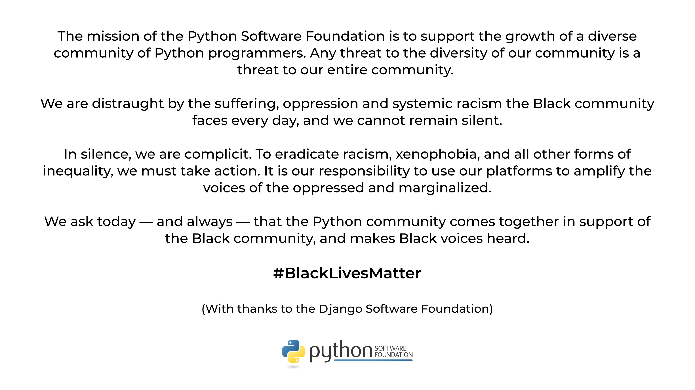

class: logo

# Michigan Python

---

# Agenda

- 7:00pm - Opening announcements
- 7:10pm - Main Topic - Intro to Django Channels
- 8:00pm - Q&A

---

---

# PyCon 2020 is Online Now
# https://us.pycon.org/2020/online/

---

# Speakers Needed for 2020!

- We want a diverse (age, gender, religion, race, sexuality, python skill level) range of speakers from our community
- If you're thinking: "but they don't mean me", we especially mean YOU.
- Speaker mentors available
- Let's fill all dates now!

---

# Next Meetup

- First Thursday: July 2, 7pm
- Topics: TBD, maybe your talk?
- Location: Online!

---

class: title

# Job Seekers

- Who you are
- Your previous experience
- What you are looking for

---

class: title

# Companies Hiring

- Company
- What you do
- The job role
- Who you are looking for

---

class: title

# Main Topic

---
