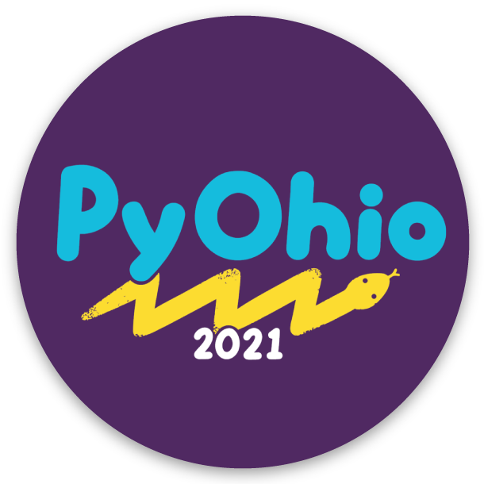

class: logo

# Michigan Python

---

# Agenda

- 7:00pm - Opening announcements
- 7:10pm - Python for 3D Ultrasound Image Using a 2D Scanner
- 7:50pm - Q&A

---

# Michigan Python is on YouTube
# Check Out Previous Talks!

---

# Speakers Needed!

- We want a diverse (age, gender, religion, race, sexuality, python skill level) range of speakers from our community
- If you're thinking: "but they don't mean me", we especially mean YOU.
- Speaker mentors available
- Let's fill all dates now!

---

# Next Online Meetup

- First Thursday: July 1, 7pm
- Topic: TBD
- Speaker: Maybe You? 

---

- The FREE neighboring Python conference
- Saturday, July 31, 2021
- Online event

---

class: title

# Job Seekers

- Who you are
- Your previous experience
- What you are looking for

---

class: title

# Companies Hiring

- Company
- What you do
- The job role
- Who you are looking for

---

class: title

# Main Topic

